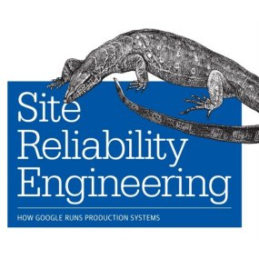

CockroachDB VirtualBox VM
=========================

Underground will live forever baby. We're just like roaches, never dying, always living, and on that note, lets get back to the program ...

CockroachDB is a new type of database that is under the category of NewSQL.

The NewSQL description from Wikipedia is

> NewSQL is a class of modern relational database management systems that seek to provide the same scalable performance of NoSQL systems for online transaction processing (OLTP) read-write workloads while still maintaining the ACID guarantees of a traditional database system

How and why am I interested in CockroachDB?

I came to CoachroachDB through the Site Reliability Engineering book; a book written by Google employees involved in DevOPS.



The book is a great read although it can be hard going as the terminology is specific to a lot of internal Google products.

Being an Enterprise developer several of the (then) internal products interested me (actually A LOT of Google tech interests me; Cloud DataFlow, Kubernetes, Go, GRPC, Protobuf to name but a few).

One of those products one that really hit home was Spanner, a large scale NewSQL database. This is because we have several clustered and replicated database so I needed to contrast and compare against what I already know.

Thinking Spanner was too big for home development (and targetted to a Google requirement) I investigated other NewSQL databases and choose two to experiment with
* CockroachDB
* MemSQL 

# CockroachDB
Cockroach Labs was founded in 2015 by ex-Google employees Spencer Kimball, Peter Mattis, and Ben Darnell. Prior to Cockroach Labs, Kimball and Mattis were key members of the Google File System team while Darnell was a key member of the Google Reader team.

There are a few small scale personal development where I have used CockroachDB and what do I think? Actually I like it, it is easily accessible, good documentation, very simple to use, really nice dashboard out of the box.

CockroachDB official site is here: https://www.cockroachlabs.com/
The github page is here: https://github.com/cockroachdb/cockroach

Got any more questions? go here: https://www.cockroachlabs.com/docs/stable/frequently-asked-questions.html#what-is-cockroachdb

# What is in this repo?

This is a Vagrant definition for a VirtualBox machine running Docker with three instances of CockroachDB all running as Docker containers.

From this you can follow the instructions at https://www.cockroachlabs.com/docs/stable/start-a-local-cluster-in-docker.html#os-linux

And yes, the dashboard will work, I've mapped port 8080 from your host to the guest machine (trusty ubuntu) so feel free to enter

````
http://localhost:8080
````

into any browser!

The reason for the repo, to make an ultra quick getting started tutorial even quicker.

License and Authors
-------------------
Please see [LICENSE][licence]
Authors: Chris Sullivan

[licence]: https://github.com/chrisgit/database-cockroach_getting_started/blob/master/LICENSE
